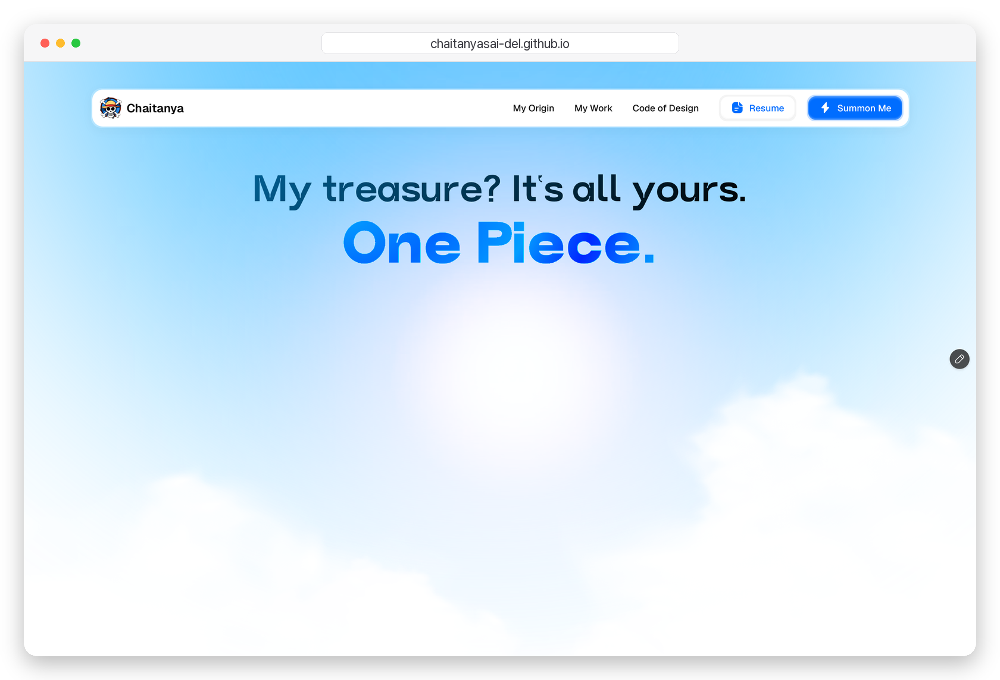

# Konichiwa 👋

  

<!-- Previous header GIF (kept, not deleted). To restore, replace the block above with:

-->

 
 
 

# About ME 💬 :

### - A { PASSIONATE PROGRAMMER } AND < SELF TAUGHT DEVELOPER /> ;

### - Learnt :
- ✨ Python
- ✨ c#

### - Hobbies : 
- ✨ Visual Design
- ✨ 3d Motion Graphic
- ✨ Video Editing
- ✨ Watching Anime

 
 
 

# Contact Me :

  

If you want to reach out to me about anything, be it some doubt or just to hangout  just ping me 😉.

<a href="https://www.linkedin.com/in/chaitanya-sai-gummadavalli-51561a1ba/">
  
 
 
 
</a>

 

 

 
 
 
 
 
 
 

*************
